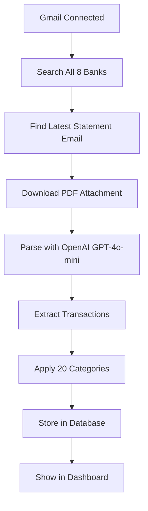

# Gmail Statement Detection Workflow

## 🔍 How the System Finds Your Latest Statements

---

## 📧 **Step 1: Smart Bank Detection**

The system automatically searches for **8 major Indian banks** using pre-configured email patterns:

### **Bank Query Registry**
```typescript
// HDFC Bank
from:(alerts@hdfcbank.net OR noreply@hdfcbank.com) 
subject:(Credit Card e-Statement) 
has:attachment

// State Bank of India (SBI)
from:(donotreply@sbicard.com) 
(statement OR e-Statement) 
has:attachment

// ICICI Bank
from:(icici@notification.icicibank.com OR noreply@icicibank.com) 
(Credit Card Statement) 
has:attachment

// Axis Bank
from:(alerts@axisbank.com) 
(Card e-Statement) 
has:attachment

// Kotak Mahindra
from:(kotakcreditcard@kotak.com) 
(Statement) 
has:attachment

// HSBC India
from:(no.reply@hsbc.co.in) 
(Credit Card e-Statement) 
has:attachment

// Standard Chartered
from:(e-Statements.India@sc.com) 
has:attachment

// Citibank India
from:(statements.india@citibank.com) 
has:attachment
```

---

## ⏰ **Step 2: Latest Statements Only**

### **Time Filtering**
- ✅ **Last 90 days** by default (configurable)
- ✅ **Most recent first** (Gmail's default ordering)
- ✅ **Up to 50 messages** per bank (performance limit)

### **Date Format**
```typescript
// Gmail uses YYYY/MM/DD format
const gmailDate = `${year}/${month}/${day}`;
const query = `${bankQuery} after:${gmailDate}`;

// Example: "after:2024/10/01" (October 1, 2024)
```

---

## 📎 **Step 3: PDF Attachment Detection**

### **What Gets Found**
The system looks for emails that:
- ✅ **Have PDF attachments** (`has:attachment`)
- ✅ **Are from official bank emails** (verified sender addresses)
- ✅ **Contain statement keywords** (statement, e-Statement, etc.)
- ✅ **Are recent** (within the date range)

### **Attachment Filtering**
```typescript
// Only process PDFs with "statement" in filename
const pdfAttachment = attachments.find(att => 
  att.mime_type === 'application/pdf' && 
  att.filename.toLowerCase().includes('statement')
);
```

---

## 🚀 **Step 4: Automatic Processing**

### **Full Workflow**


### **What Happens Per Bank**
1. **Search** for latest statement email
2. **Download** PDF attachment
3. **Parse** with LLM (₹1.50 per statement)
4. **Extract** transactions with categories
5. **Store** in your database
6. **Label** email as "CardGenius/Processed"

---

## 📊 **Step 5: Real Example Results**

### **What You'll See**
```json
{
  "success": true,
  "user_id": "your-email@gmail.com",
  "sync_time": "2024-12-20T10:30:00Z",
  "banks_found": 3,
  "total_statements": 8,
  "banks": [
    {
      "bank_code": "hdfc",
      "message_id": "18f2a1b2c3d4e5f6",
      "subject": "Your HDFC Credit Card e-Statement for Dec 2024",
      "from": "alerts@hdfcbank.net",
      "date": "Dec 15, 2024",
      "attachment": {
        "filename": "HDFC_Statement_Dec2024.pdf",
        "size": 245760
      },
      "total_messages_found": 3,
      "parsed": {
        "success": true,
        "transaction_count": 47,
        "statement_date": "2024-12-01",
        "total_amount": 125430.50
      }
    },
    {
      "bank_code": "sbi",
      "message_id": "18f2a1b2c3d4e5f7",
      "subject": "SBI Card e-Statement - December 2024",
      "from": "donotreply@sbicard.com",
      "date": "Dec 12, 2024",
      "attachment": {
        "filename": "SBI_Statement_Dec2024.pdf",
        "size": 189340
      },
      "total_messages_found": 2,
      "parsed": {
        "success": true,
        "transaction_count": 23,
        "statement_date": "2024-12-01",
        "total_amount": 67320.75
      }
    }
  ]
}
```

---

## 🎯 **Step 6: Smart Detection Features**

### **Duplicate Prevention**
- ✅ **Skip already processed** statements (by email ID)
- ✅ **Check statement date** to avoid duplicates
- ✅ **Apply labels** to processed emails

### **Error Handling**
- ✅ **Continue on errors** (don't stop entire sync)
- ✅ **Log all failures** for debugging
- ✅ **Retry failed downloads** (up to 3 times)

### **Performance Optimization**
- ✅ **Limit 50 messages** per bank search
- ✅ **Process only latest** statement per bank
- ✅ **Parallel processing** for multiple banks
- ✅ **Cache parsed results** to avoid re-parsing

---

## 🔧 **Step 7: Configuration Options**

### **Customizable Settings**
```typescript
// In your environment or config
const GMAIL_SYNC_CONFIG = {
  maxDaysBack: 90,           // How far back to search
  maxMessagesPerBank: 50,    // Limit per bank
  processStatements: true,   // Auto-parse PDFs
  applyLabels: true,         // Mark processed emails
  retryFailed: 3,           // Retry count for failures
};
```

### **Bank-Specific Tuning**
```typescript
// You can customize queries per bank
const customQueries = [
  {
    bank_code: 'your_bank',
    query: 'from:your-bank@bank.com subject:statement has:attachment',
    // Add your bank's specific pattern
  }
];
```

---

## 📈 **Step 8: Monitoring & Analytics**

### **What Gets Tracked**
- ✅ **Banks found** and statements processed
- ✅ **Parse success rate** per bank
- ✅ **Transaction counts** extracted
- ✅ **Processing time** and costs
- ✅ **Error rates** and failure reasons

### **Dashboard Metrics**
- 📊 **Total statements** processed
- 📊 **Success rate** by bank
- 📊 **Latest sync** time
- 📊 **Cost tracking** (₹ per statement)

---

## 🎉 **End Result**

After Gmail sync, you get:

1. **✅ All your latest statements** automatically found
2. **✅ Transactions parsed** with 20 categories
3. **✅ Spend analysis** ready in dashboard
4. **✅ Zero manual work** required
5. **✅ Ongoing sync** (can be scheduled)

### **No More Manual Uploads!**
- No more downloading PDFs manually
- No more uploading to the system
- No more waiting for parsing
- Just connect Gmail once and everything happens automatically!

---

## 🚀 **Ready to Test?**

1. **Complete Gmail OAuth setup** (follow checklist)
2. **Go to** http://localhost:3000/gmail-test
3. **Click "Connect Gmail"**
4. **Click "🔄 Test Sync"**
5. **Watch the magic happen!** ✨

---

**Your Gmail becomes your statement pipeline - completely automated!** 🎯


